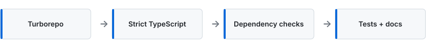
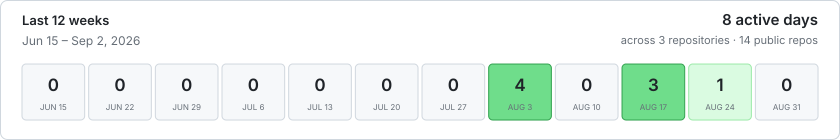

<strong>FRONTEND SYSTEMS &amp; ENGINEERING LEADERSHIP</strong>

# Ivan Reutenko

Most recently a **Frontend Architect**, focused on architecture, developer experience, and systems that remain understandable as teams and products scale.

Previously **Tech Lead** and **Team Lead**.

## Focus

**Architecture** · Boundaries, contracts, evolvability. 
**Developer experience** · Fast feedback and paved paths. 
**Scalability** · Code and practices that survive growth.

## Selected engineering work

**The codebase is the proof.** These projects show how I turn architectural decisions into implementation constraints, and developer experience into reliable tooling and feedback loops. The goal is not only clean structure, but systems that teams can extend, validate, and evolve with confidence.

<strong>01 · IMPLEMENTATION QUALITY</strong>

### [mk-combos](https://github.com/reutenkoivan/mk-combos)

A local-first React codebase where ownership boundaries are executable constraints, not just documentation.

<picture>
  <source media="(max-width: 600px)" srcset="./assets/mk-combos-signals-mobile.svg">
  
</picture>

[Explore the implementation →](https://github.com/reutenkoivan/mk-combos)

---

<strong>02 · DEVELOPER EXPERIENCE</strong>

### [typescript-cli-template](https://github.com/reutenkoivan/typescript-cli-template)

A scalable TypeScript CLI foundation with strict defaults, shared tooling, caching, tests, dependency checks, and documentation.

<picture>
  <source media="(max-width: 600px)" srcset="./assets/typescript-cli-template-signals-mobile.svg">
  
</picture>

[Explore the toolchain →](https://github.com/reutenkoivan/typescript-cli-template)

---

### Public GitHub activity

