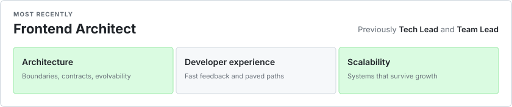
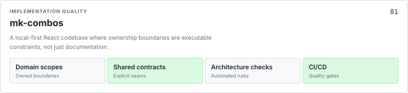
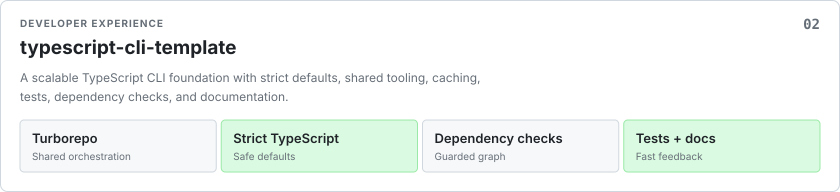

# Ivan Reutenko

<picture>
  <source media="(max-width: 600px)" srcset="./profile/identity-mobile.svg">
  
</picture>

## Selected engineering work

<picture>
  <source media="(max-width: 600px)" srcset="./profile/engineering-approach-mobile.svg">
  
</picture>

<picture>
  <source media="(max-width: 600px)" srcset="./assets/mk-combos-project-mobile.svg">
  
</picture>

[Explore the implementation →](https://github.com/reutenkoivan/mk-combos)

<picture>
  <source media="(max-width: 600px)" srcset="./assets/typescript-cli-template-project-mobile.svg">
  
</picture>

[Explore the toolchain →](https://github.com/reutenkoivan/typescript-cli-template)
